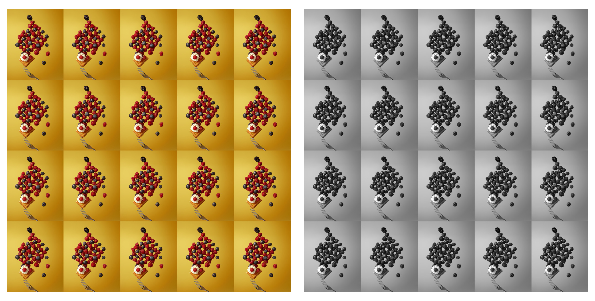

# Image Greyscaler CUDA Benchmark Results

## Data

- Image dimensions (pixels): `28000x28000` (`FHD == 1920x1080`)

  

- Image size (bytes): `119,828,615`

## Results

Following results are average of _only processing time_ of transforming the image `2000` times on each different even-number of GPU threads:


## Hardware/Software Specifications

```txt
CUDA Device Query (Runtime API) version (CUDART static linking)

Detected 1 CUDA Capable device(s)

Device 0:
  CUDA Driver Version / Runtime Version          11.3 / 11.3
  CUDA Capability Major/Minor version number:    5.0
  Total amount of global memory:                 3998 MBytes (4192337920 bytes)
  (005) Multiprocessors, (128) CUDA Cores/MP:    640 CUDA Cores
  GPU Max Clock rate:                            1110 MHz (1.11 GHz)
  Memory Clock rate:                             2700 Mhz
  Memory Bus Width:                              128-bit
  L2 Cache Size:                                 2097152 bytes
  Total amount of constant memory:               65536 bytes
  Total amount of shared memory per block:       49152 bytes
  Total shared memory per multiprocessor:        65536 bytes
  Total number of registers available per block: 65536
  Warp size:                                     32
  Maximum number of threads per multiprocessor:  2048
  Maximum number of threads per block:           1024
  Max dimension size of a thread block (x,y,z): (1024, 1024, 64)
  Max dimension size of a grid size    (x,y,z): (2147483647, 65535, 65535)

deviceQuery, CUDA Driver = CUDART, CUDA Driver Version = 11.3, CUDA Runtime Version = 11.3, NumDevs = 1
Result = PASS
```
