# CUDA Implementation Details

## 1. Define error handler macro

   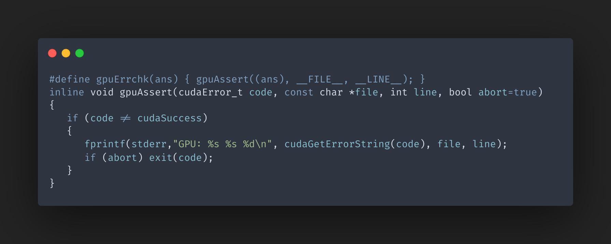

## 2. Define kernel

   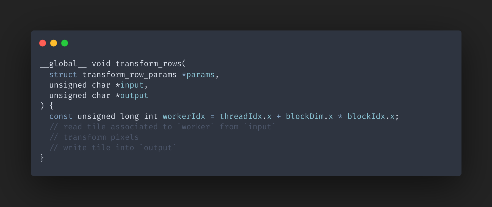

## 3. Allocate space on GPU for input image

   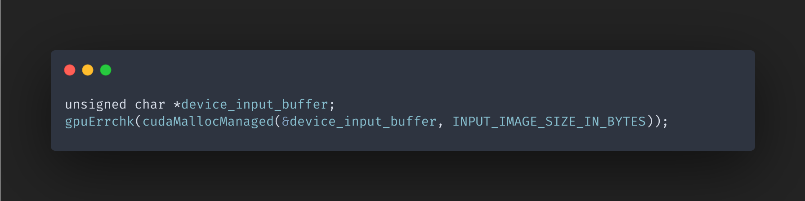

## 4. Copy input image from RAM to GPU DRAM

   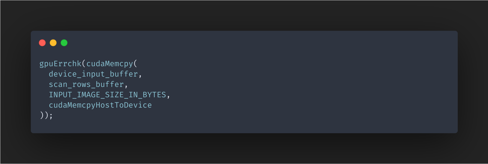

## 5. Allocate space on GPU for kernel arguments

   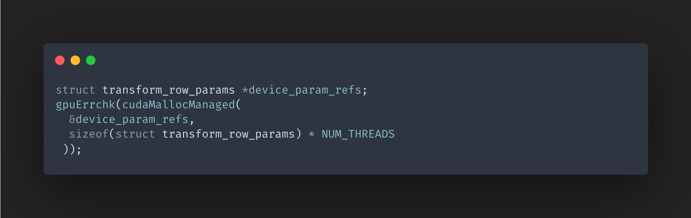

## 6. Copy kernel arguments to GPU DRAM

   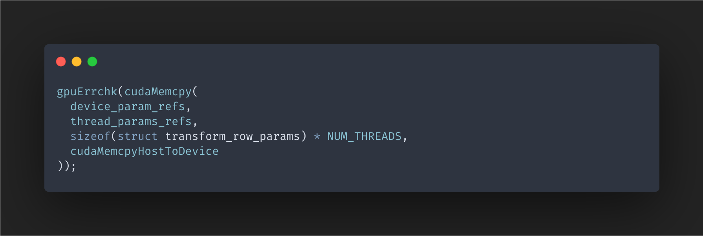

## 7. Allocate space on GPU for output image

   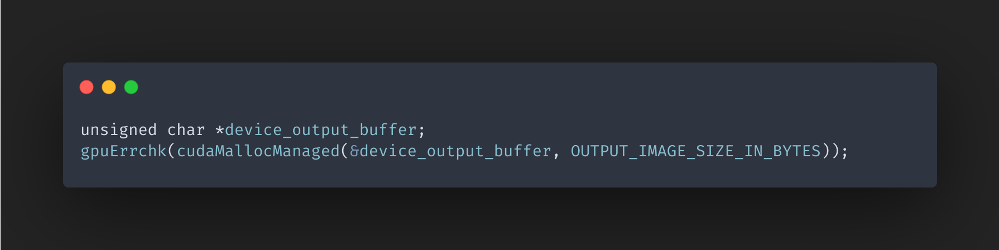

## 8. Launch the kernel

   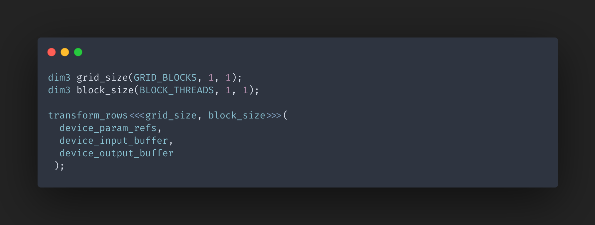

## 9. Handle kernel launch error

   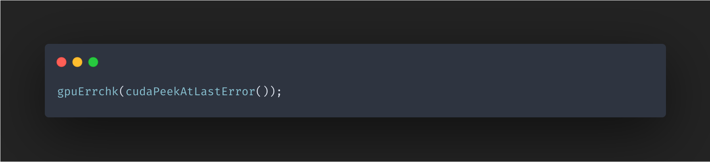

## 10. Wait for GPU to finish

   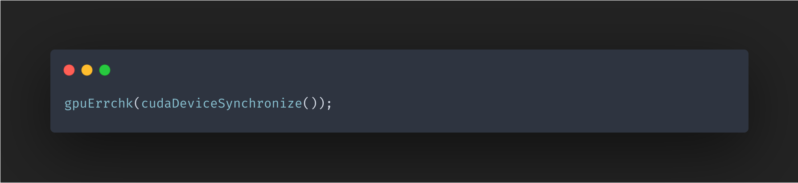

## 11. Copy the result from GPU DRAM to RAM

   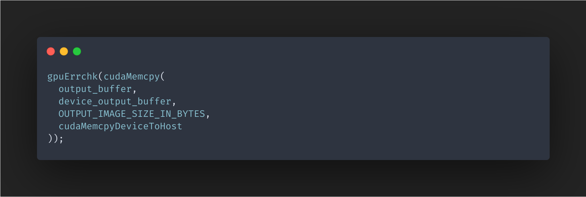
